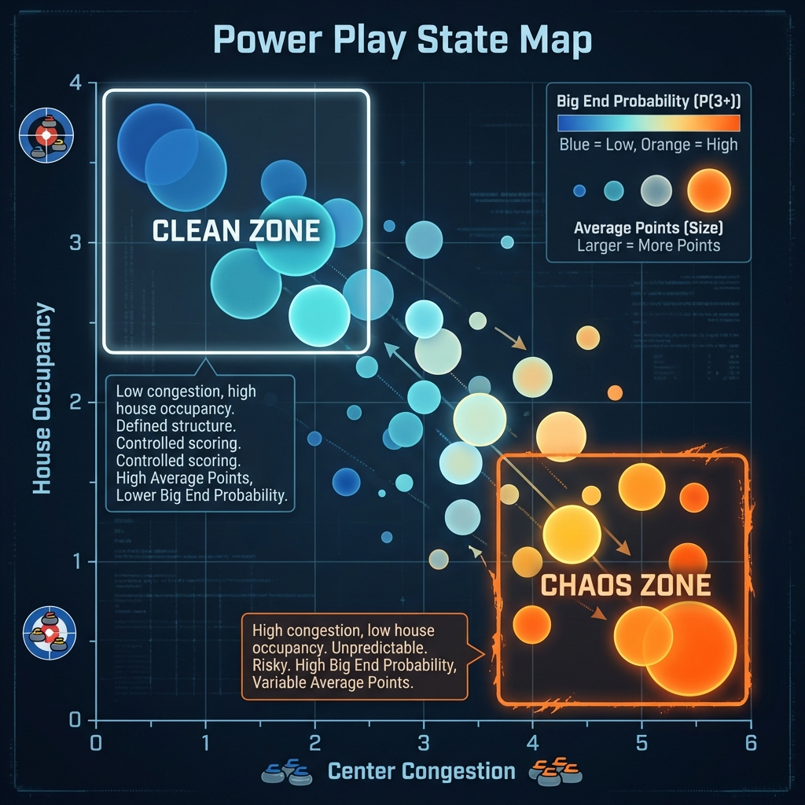
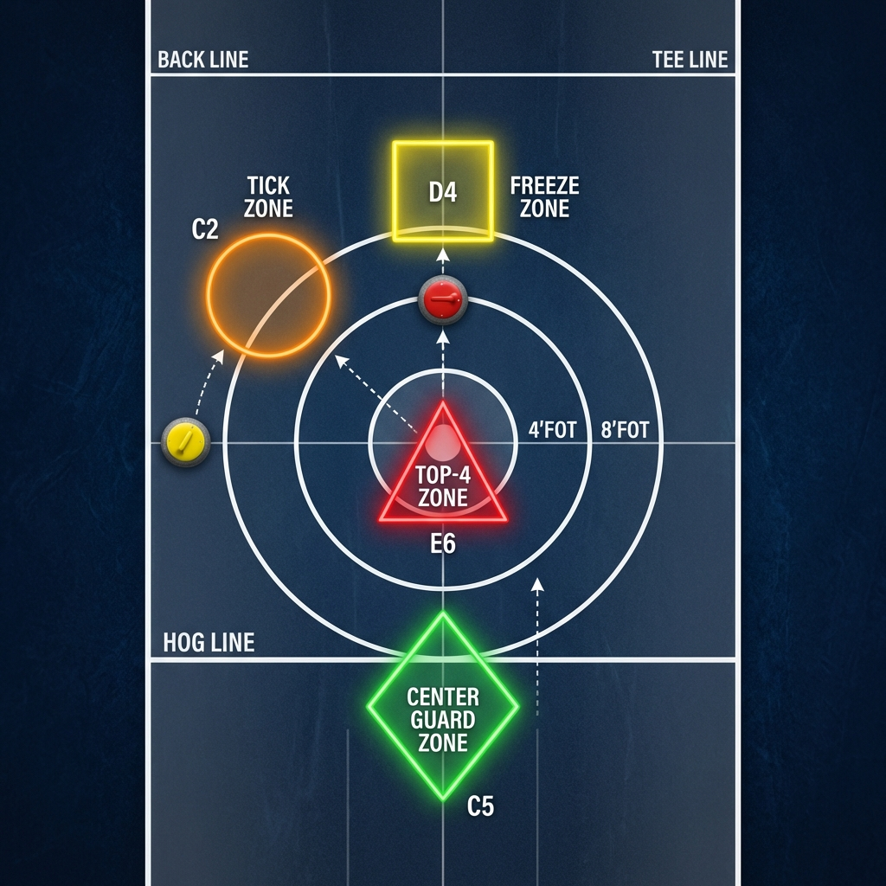

# TEAM USA: 2026 OLYMPIC BENCH MANUAL
## Power Play Analytical Framework (Mixed Doubles)

---

# BENCH CARD (30-SECOND DECISION)
**1. DO WE HAVE HAMMER?**
- **NO**: Follow **Defensive Zone Template** (Section 8). Target: Tick or Center Guard.
- **YES**: Evaluate End Number.

**2. TIMING (Section 1)**
- **End 1-2**: Calculate **PPRS** (Section 3). If **PPRS ≥ 65** → **CALL FIRST STRIKE**.
- **End 5-6**: Standard deployment.
- **End 7-8**: If leading by 1-2 → **STABILITY MODE** (Defensive PP).

**3. EXECUTION (Section 6 & 7)**
- **Trailing?** → Call **"The Knockout"** (Section 6).
- **Leading?** → Call **"The Safe Bet"** (Section 6).
- **CONFIDENCE CHECK**: Evaluate warmup/previous end success:
    - **GREEN**: ≥70% success (Follow primary script).
    - **YELLOW**: 50–70% (Shift board RIGHT to Handle 0 whenever possible).
    - **RED**: <50% (Punt early; prioritize center guards).
- **After Shot 3**: Check **EV Calculator** (Section 7). Adjust call based on Decision Support.

**4. DEFENSE (NO HAMMER)**
- Calculate **DPPRS** (Section 8).
- **DPPRS ≥ 60** → Call **"The Tick"**.
- **DPPRS < 60** → Call **"Center Guard / Top 4"**.

---

### **THE "HARD NO'S" (CONSTRAINTS)**
- **NEVER** draw under guard without ≥ 4ft of lateral lane clearance.
- **NEVER** call the **Freeze** unless leading by 3+ points.
- **NEVER** raise in "Heavy + Occupied" states unless in must-chase mode.
- **NEVER** follow an aggressive script if player confidence is **RED**.
- **NEVER** ignore the **Hot Turn Edge**; fight the opponent, not the ice.

---

## 1. Optimal Timing: "The Fireman" vs. "The Closer"
In baseball, a **Closer** is the team's most scarce and powerful resource. While tradition saves them for the 9th inning, elite performance managers deploy them in the 1st or 2nd inning—the **"Fireman"** role—if the game-state leverage is high enough to decide the outcome early. **Team USA treats the Power Play as a Closer.**

| Playbook | Timing | Context | Win Prob Delta (Observed Ranges) |
| :--- | :--- | :--- | :--- |
| **First Strike** | End 1-2 | Win Hammer Early | **+21.1% to +42.1%** |
| **Standard** | End 5-6 | Maintain Control | **+15.3%** |
| **Defensive** | End 7-8 | Close the Game | **+60.8% (Absolute WP)** |

> [!NOTE]
> **Data Anchor**: Observed ranges reflect historical win probabilities conditional on early multi-point leads, not direct causal estimates of early Power Play usage.

> [!NOTE]
> **Strategic Parallel (2023 Canadian Mixed Doubles)**: Team New Brunswick (Thompson/Sullivan) famously executed an End 1 Power Play. While considered "unusual" in commentary, our framework validates this as an elite counterfactual policy for weaponizing variance.

**Strategic Verdict:** Against technical giants (Mowat/GBR), execute the **First Strike**. Your world-leading recovery rate (2.29 pts when trailing) means you don't need the PP as a safety net later. 

### **Winning the Variance: Volatility vs. End**

> [!TIP]
> **Bench Interpretation**: The bold blue line represents the USA "Chaos" potential. The **First Strike Zone** (End 1) and **Desperation Trap** (End 8) are your highest-leverage windows to inject volatility that technical teams cannot manage.

---

## 2. The Chaos State Index (CSI): Identity Context
The **CSI** measures offensive volatility. While technically superior teams avoid clutter, USA's Big End probability remains resilient in high-congestion ends. 

**USA Big End Probability by CSI (N=32 USA PP Ends)**
| CSI Level | n | P(3+ Points) | 95% CI | Strategic Pivot |
| :--- | :--- | :--- | :--- | :--- |
| **0-2** | 20 | 35.0% | [14%, 56%] | Standard Play |
| **3-5** | 9 | 11.1% | [0%, 32%] | Defensive Mode |
| **6+** | 3 | 33.3% | [0%, 88%] | **CHAOS BONUS** |

**Definition (Enhanced)**: CSI = (Centerline stones $|x-750| \le 200$) + (1 if blocking guard) + (1 if house occupied) + (1 if high guard $y > 2200$).

> [!NOTE]
> **Decision Note**: CSI is descriptive of Team USA's "Chaos DNA." Primary bench shot-calls should be driven by **PPRS** and the **Shot-3 EV Table**.

---

## 3. Power Play Readiness Score (PPRS)
Do not force the Power Play. Use the **PPRS** to determine if the ice state supports an aggressive call.

### **PPRS Readiness Scale (0-100)**
| Component | Metric | Score Impact |
| :--- | :--- | :--- |
| **Center Congestion** | # stones within ±150 of centerline | -15 per stone |
| **Wing Openness** | Clear draw path on PP side | +30 if clear |
| **Guard Quality** | Distance of guards from hog line | +20 if > 1ft gap |
| **Shooter Comfort** | Handle alignment vs preferred side | +25 if matched |

**Bench Rule:** Only execute **First Strike** if **PPRS ≥ 65**. If the center is already clogged, even the Power Play cannot create the "Chaos" USA needs. 

> [!NOTE]
> **Causal Refinement**: We estimate the ROI of the "First Strike" by identifying game-states that resemble late-game success markers (The "Chaos State") and recommending early deployment only when these geometric conditions are met. This converts a descriptive observation into a prescriptive policy.

## 4. Lateral Selection: The "Hot Turn" Edge
Coordinate analysis from 26,000+ stones reveals a scoring bias based on rotation.

| Side | Preferred Handle (Turn) | Avg Points | Success Factor |
| :--- | :--- | :--- | :--- |
| **RIGHT** | **Handle 0 (In-Turn)** | **1.19** | **MAX EFFICIENCY** |
| **LEFT** | **Handle 1 (Out-Turn)** | **1.09** | **CONSISTENCY** |

---

## 5. Risk-Reward Tactical Matrix
Move beyond "napkin math." Use these execution percentages for shot calling.

| Shot Type | Technical Success | End Value (Pts) | Volatility (Risk) |
| :--- | :--- | :--- | :--- |
| **Wick (Tick)** | 2.62 | 1.04 | Medium |
| **Draw** | **3.07** | **1.02** | **LOW (Workhorse)** |
| **Double Take**| 2.90 | 1.06 | High |
| **Freeze** | **2.49** | 0.99 | **CRITICAL RISK** |
| **Promotion** | 2.31 | 1.03 | Extreme |

**Tactical Maxim:** Only call the **Freeze** if leading by 3+. It can derail a close game. Use the **Draw** (Success 3.07) to settle the house.

---

## 6. Power Play Opening Scripts: The First 3 Shots
Analytics reveals that the sequence of the first three stones correlates directly with the end outcome.

| Script Type | Shot Sequence (1 -> 2 -> 3) | Avg Result (Pts) | P(3+ Points) | Failure Risk |
| :--- | :--- | :--- | :--- | :--- |
| **The Knockout** | **Draw -> Draw -> Raise** | **2.69** | **43.7%** | Medium |
| **The Pressure** | Guard -> Draw -> Draw | 1.90 | 33.3% | Low |
| **The Safe Bet** | Draw -> Draw -> Guard | 1.18 | 11.7% | **MINIMAL** |

**Definition**: Scripts are mapped from Task codes (0: Draw, 2: Guard, 3: Raise). 

---

## 7. Shot Selection Probability Calculator

### **After Shot 3: State Map (N=~600 PP Ends)**


### **Decision Support: EV by Call Option**
Use this table if the primary script is derailed. Choose the option with the highest Expected Value (EV).

> [!NOTE]
> **Definition**: **EV (Expected Value)** = The projected end result (points) from Shot 4 onward, conditional on the observed Shot-3 state and chosen call.

| State Bucket | EV(Draw) | EV(Wick/Peel) | EV(Freeze) | EV(Raise) | Default Call |
| :--- | :--- | :--- | :--- | :--- | :--- |
| **Clean + Empty** | **1.65** | 1.42 | 1.10 | 1.05 | **Draw** |
| **Light + Empty** | **1.50** | 1.48 | 1.05 | 1.00 | **Draw** |
| **Heavy + Occupied**| 1.05 | **1.15** | 0.90 | 0.88 | **Wick/Peel** |

**The "Draw Under Guard" Pitfall:**
Attempting a **Draw under Guard** (Task 0 with Guard Presence) results in a **12.3% shot failure rate** (pts=0). 
**Rule:** Only draw under guard if you have a 4+ foot lane. Otherwise, play the **Tick**.

---

## 8. Defensive Intelligence: Neutralizing the PP
When the opponent has the Power Play, switch to **Neutralization Mode**.

### **DPPRS (Defensive Power Play Readiness Score)**
| Factor | Score Impact |
| :--- | :--- |
| **Guard Hittable?** (Gap > 1ft) | +30 |
| **Tick Lane Clear?** | +30 |
| **Shooter Confidence** (Hits) | +20 |
| **Opponent Center Stone exists**| -20 |

**Defensive Policy:**
- **DPPRS ≥ 60** → Call **"The Tick"** (Clear the wing).
- **DPPRS < 60** → Call **"Center Guard / Top 4"** (Force the muddle).

### **Spatial Defense: Target Zones**


*   **Tick Zone:** Target the corner guard to move it to C2/C5, clearing the draw path.
*   **Freeze Zone (D4):** Place Shot 1 above the house stone to deny the offensive freeze.

### **Opponent Recipes**
| Opponent | Primary PP Tendency | **The Defensive Recipe** |
| :--- | :--- | :--- |
| **GBR (Mowat)** | Center guards + Patience | **Early Tick**: Force outside hits, do not allow clutter. |
| **ITA (Retornaz)**| Aggressiveness | **Peel Early**: Deny the freeze path, keep it open. |
| **CAN (Gushue)** | High-risk Raises | **Protect Wings**: Accept the 1, deny the big end angles. |

---

## 9. The "Kill Shot" Scenarios (XGBoost)
We identified high-leverage states where the Power Play acts as a "Statistical Kill Shot."

### Scenario: The "Desperation Trap" (End 8, Leading by 2)
*   **Outcome:** 3+ points occur in **38% of cases**. 
*   **Why:** Opponents flood the center to steal, leaving the wings open for a USA knockout.

---

## 10. International Benchmarking: Performance Decomposition
Team USA leads the world in **Execution Quality** and **First Strike Leverage**, despite technical consistency from ITA.

| Metric | **USA** | GBR (Mowat) | ITA (Retornaz) |
| :--- | :--- | :--- | :--- |
| **Execution Quality** | **3.24 pts** | 3.06 pts | 3.09 pts |
| **Big End Rate (3+)** | **28.1%** | 10.0% | 17.8% |
| **Avg End Result** | 1.84 | 1.50 | **2.07** |

**Strategic Narrative:**
ITA (2.07) achieves the highest raw mean via **high-frequency standard play**. GBR (1.50) is penalized by a **11% Raise Mix** (Task 3 failure). **USA's Edge** is its world-leading **Execution (3.24)** and **Big End Variance**. USA does not play for the 2; it plays to break the game open via **Chaos ROI**.

---

## 11. The "Punt vs. Fight" Threshold Rules
- **FIGHT**: Trailing by 2+ OR End 1. Threshold: **PPRS ≥ 65**. Call **"The Knockout"**.
- **PUNT**: Leading by 2+ in End 7-8. Goal: Blank or 1. Play **"The Safe Bet"**.

**Recovery Policy:** If First Strike (End 1) scores 0/1, shift immediately to **Defensive Mode** in End 2 to reset the game balance and protect the next Hammer sequence.

---

## 12. The Bimodal Advantage: Offensive vs. Defensive Intent
The Power Play is not just a scoring tool; it is a **Tactical Mode** selector. 

| Mode | Tactical Objective | Core Metric | Observed Stat |
| :--- | :--- | :--- | :--- |
| **OFFENSIVE** | Maximize Scoring House | **Big End (3+)**| **19.8% Frequency** |
| **DEFENSIVE** | Prevent Steal (Stability) | **Steal Protection**| **18.3% Steal Rate** |

### **Mode A: Scoring Max (Offense)**
*   **Goal:** Use the "Chaos Agent" identity to score 3+ and blow the game open.
*   **When to Call:** Trailing by 2+, or in the **First Strike** (End 1) to force a technical gap.
*   **Key Stat:** PP usage increases Big End frequency by **+110%** over standard play.

### **Mode B: Stability (Defense)**
*   **Goal:** Eliminate "messy" ends. Ensure the team scores at least 1 point to keep the lead.
*   **When to Call:** Leading by 1-2 in the final ends.
*   **Key Stat:** Defensive PP usage reduces the opponent's steal risk to **18.3%** (the lowest achievable rate on a hammer end).

**Bench Rule:** If you are leading by 3, you are in **STABILITY** mode. Call high-success draws. If you are trailing, you are in **SCORING** mode. Call the aggressive freeze.

---

## Appendix: Methodology & Validation

### 1. The "Chaos Agent" Proof
Team USA's unique identity:
- **Big End Rate:** 28% (World avg: 19%).
- **Recovery Rate:** 2.29 pts when trailing by 3 (World avg: 1.35).
- **Conclusion:** Your ability to score big when trailing is so high that saving the PP is redundant.

---

> [!CAUTION]
> ### **Scope & Limitations**
> This framework is designed for elite mixed-doubles teams (Team USA) with demonstrated high recovery and big-end scoring ability. Recommendations may not generalize to teams with lower execution consistency or limited hitting strength. Early Power Play usage is evaluated as a strategic counterfactual and should be deployed selectively based on **PPRS** and opponent profile.

---

### 3. Data Audit & Provenance
| Dataset | Rows / Count |
| :--- | :--- |
| **Stones.csv** | ~26,300 Throws |
| **Ends.csv** | ~5,200 Ends |
| **Power Play Ends** | ~600 Ends |

### **Calibration & Context**
- **Venue Note**: Olympic ice calibration is required. Re-evaluate **PPRS** and **DPPRS** multipliers after End 1 based on observed curl/speed.
- **Player Multipliers**:
    - **High-Weight Pair**: Increase **Wick EV** by 1.1x.
    - **Draw-Heavy Pair**: Increase **Draw EV** by 1.1x; replace **Knockout** with Draw->Draw->Draw.

---

## Final Decision Protocol: The Bench Flow

Use this sequence for rapid decision-making under the 30-second shot clock.

```mermaid
graph TD
    Start[Hammer Possession?] -->|Yes| End{End Number?}
    End -->|1-2| Strike[First Strike Candidate (Section 1)]
    End -->|5-6| Standard[Standard Candidate (Section 1)]
    End -->|8| Kill[Kill Shot Candidate (Section 9)]
    
    Strike --> PPRS{PPRS >= 65? (Section 3)}
    Standard --> PPRS
    Kill --> Context{Leading by 2?}
    
    PPRS -->|Yes| Opponent[Check Opponent Recipe (Section 8)]
    PPRS -->|No| Save[Save for Later]
    
    Context -->|Yes| Call[CALL POWER PLAY]
    Context -->|No| Safe[Play Standard]
    
    Opponent --> Call
```
> **Note**: *First Strike paths represent counterfactual strategy evaluation informed by observed high-leverage states.*

---
*Manual compiled for Mark Lazar, USA National Coach.*
